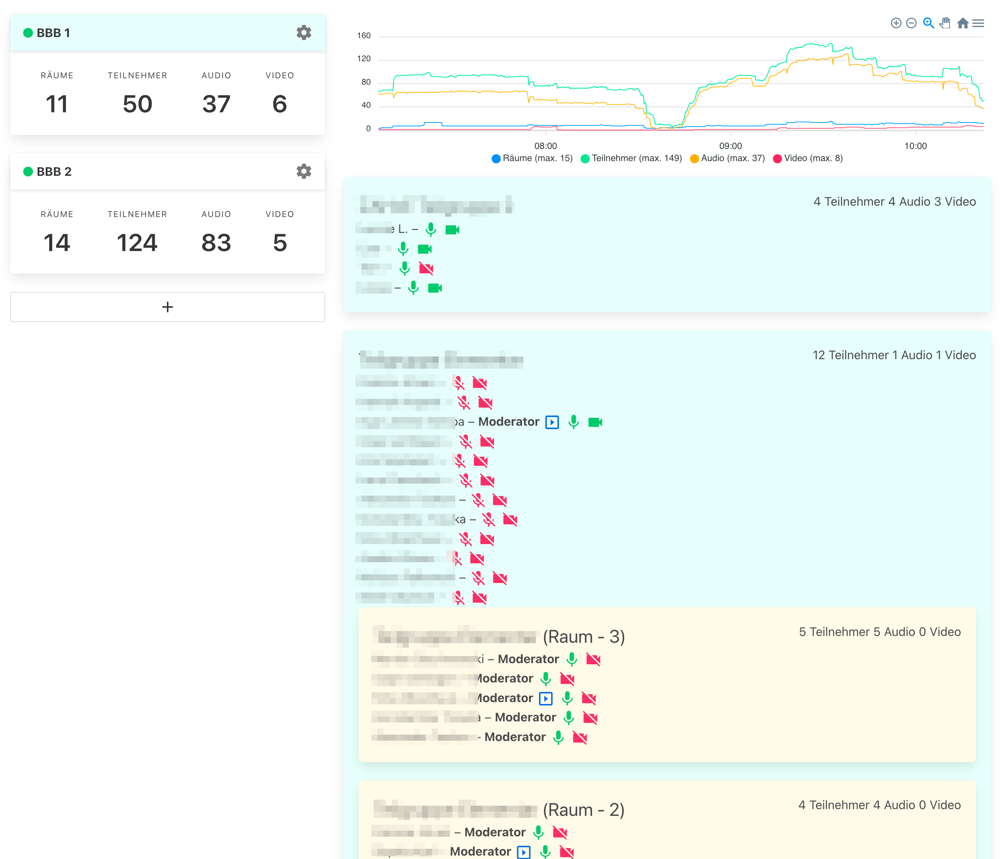

## Static monitoring solution for BigBlueButton

Simple monitoring site that runs as a static page. Can be hosted anywhere and does not need a server to run. Multiple BBB servers are supported.



You will have to allow CORS headers on your BBB instance or use a browser extension to receive the data (try Cors Everywhere for FireFox).

To enable CORS headers on your server add this location to the other loacations in `/etc/bigbluebutton/nginx/web.nginx`

```
location /bigbluebutton/api/getMeetings {
  proxy_pass         http://127.0.0.1:8090;
  proxy_redirect     default;
  proxy_set_header   X-Forwarded-For   $proxy_add_x_forwarded_for;

  add_header Access-Control-Allow-Origin *;
  add_header Access-Control-Allow-Methods "GET,OPTIONS";
  add_header Access-Control-Allow-Headers  Content-Type;
  add_header Access-Control-Max-Age        86400;
}
```

Then restart your nginx service: `sudo /etc/init.d/nginx restart`

Once on the page fill in your `server` address and the `shared secret`. You can get the `shared secret` by running `bbb-conf --secret` on your BBB server. The number to the right allows you to set the interval for data polling.

You can use the monitoring page on https://bbb-monitor.netlify.app/ Since it only sends data via fetch to your bbb server and not to any other server for processing it is safe to use without installing or setting up your own instance. You can check outgoing network connections in your browser's developer tools to see what is being sent and where.

To run it locally you will need to have node.js and git installed.

```
git clone https://github.com/hmt/bbb-static-monitor.git
cd bbb-static-monitor
npm install
npm run dev
```

You can then open your browser to https://localhost:5000 for a local instance of the page.

Or you go to [releases](https://github.com/hmt/bbb-static-monitor/releases) and download `bbb-monitor.zip`. Unzip and open the `index.html` with your browser.

If you want to contribute feel free to open a pull request or open an issue.

This little project was created with [Svelte](https://svelte.dev)

__This project uses BigBlueButton and is not endorsed or certified by BigBlueButton Inc. BigBlueButton and the BigBlueButton Logo are trademarks of BigBlueButton Inc.__

MIT Licensed
